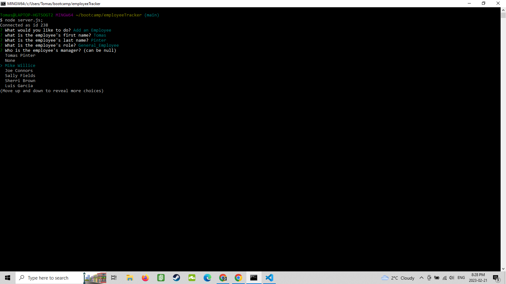
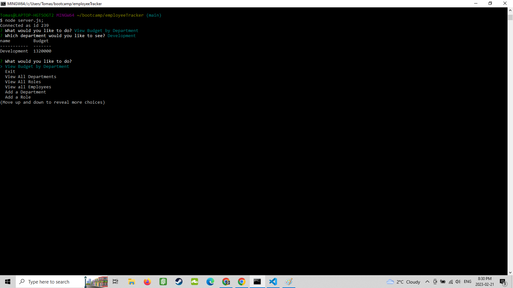

# Employee Tracker

## Description

This is a command line application I created to simluate a working employee databse. There are options to view departments, employee roles, all the employees. You can also utilize options to add/delete/and update each area of the databse. As a final piece of functionality, you can view the total utilized budget of a department. This utility uses inquirer, mysql, and console.table to create a user friendly experience. 

Through creating this app I gained a better understanding of mysql database creation and manipulation. I strengthened my ability to retrieve data points by the use of parameters and user input. 

## Table of Contents

- [Installation](#installation)
- [Usage](#usage)
- [Credits](#credits)
- [Contact](#contact)
- [License](#license)

## Installation

A few steps to get your project up and running.
- Head to [Github](https://github.com/TamasPinter/employeeTracker) and clone the repo.
- Open the repo in your terminal and run `npm install` to install the dependencies.
- Now you need to create the database. Open MySQL Workbench and run the schema.sql file.
- Then run the seeds.sql file to populate the database.

- This will install everything you need to run the app and you can move on to Usage!

## Usage

This is a command line application that allows you to view, add, and update employees, roles, and departments in a company database.

- To start the application, run `node server.js` in your terminal.
- You will be prompted with a list of options to choose from.
- Each listed option will bring you to a different menu where you can view, add, or update the corresponding data.
- The add and update options will also display your saved category afterwards so you can see the changes made.
- You can also exit the application at any time by selecting the Exit option.
.

There is also a quick video guide here: https://drive.google.com/file/d/1jfagcXpChdZOGwl85eqhfSX3w9f3MPxu/view

## Credits

The countless articles and chat sessions with fellow classmates and all the various stack overfrlow posts that helped me debug issues I had too!

## Contact

Feel free to contact me with any questions or comments!
my email: brolli_673@hotmail.com
my github: https://github.com/TamasPinter

## License

MIT License

Copyright (c) 2023 TamasPinter

Permission is hereby granted, free of charge, to any person obtaining a copy
of this software and associated documentation files (the "Software"), to deal
in the Software without restriction, including without limitation the rights
to use, copy, modify, merge, publish, distribute, sublicense, and/or sell
copies of the Software, and to permit persons to whom the Software is
furnished to do so, subject to the following conditions:

The above copyright notice and this permission notice shall be included in all
copies or substantial portions of the Software.

THE SOFTWARE IS PROVIDED "AS IS", WITHOUT WARRANTY OF ANY KIND, EXPRESS OR
IMPLIED, INCLUDING BUT NOT LIMITED TO THE WARRANTIES OF MERCHANTABILITY,
FITNESS FOR A PARTICULAR PURPOSE AND NONINFRINGEMENT. IN NO EVENT SHALL THE
AUTHORS OR COPYRIGHT HOLDERS BE LIABLE FOR ANY CLAIM, DAMAGES OR OTHER
LIABILITY, WHETHER IN AN ACTION OF CONTRACT, TORT OR OTHERWISE, ARISING FROM,
OUT OF OR IN CONNECTION WITH THE SOFTWARE OR THE USE OR OTHER DEALINGS IN THE
SOFTWARE.
